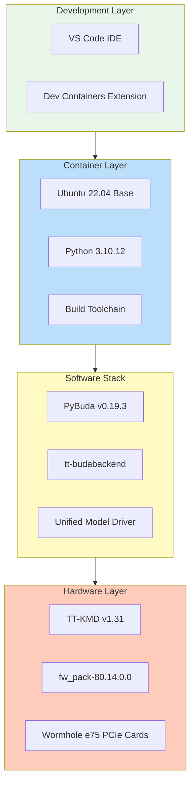
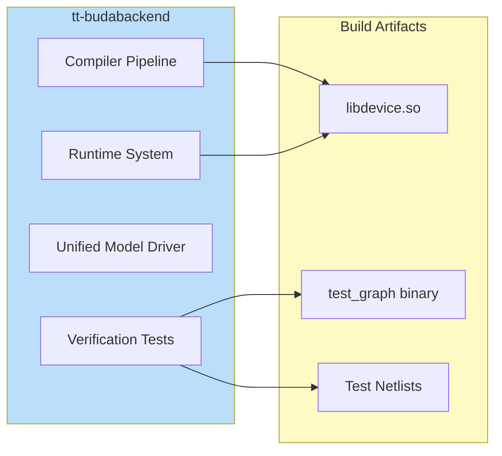
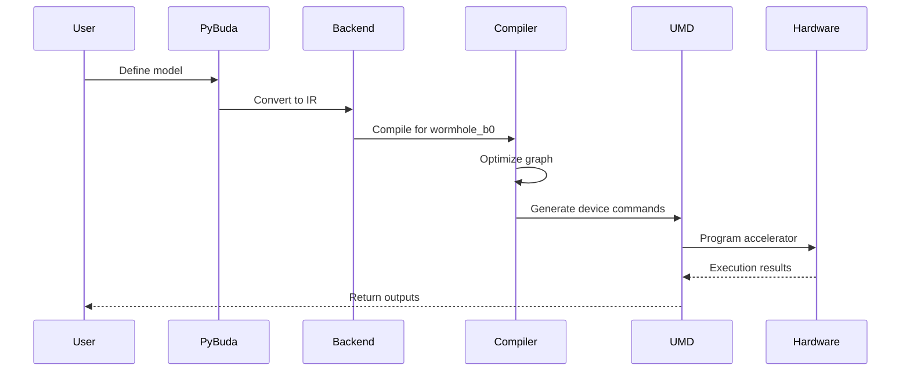
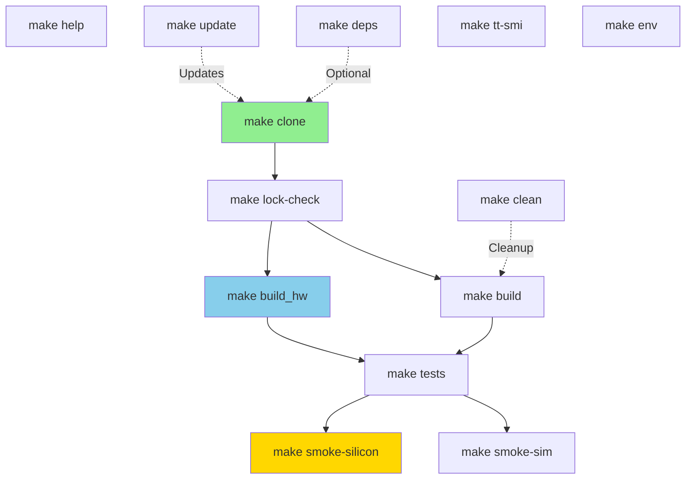
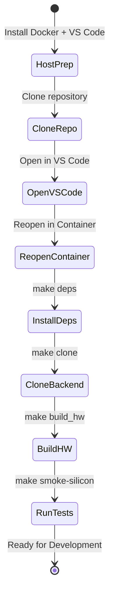
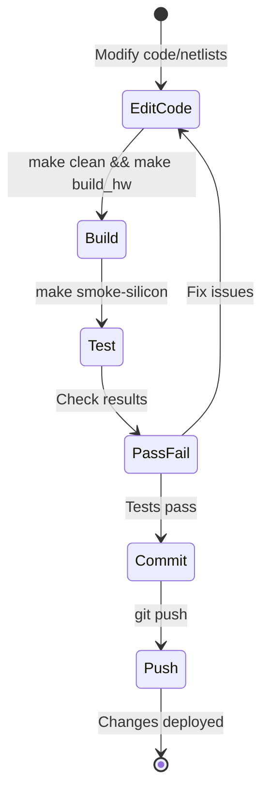

# Architecture Documentation

## Overview

This document provides detailed technical information about the Tenstorrent Wormhole e75 development environment architecture, component interactions, and design decisions.

## System Architecture

### Layered Architecture



## Component Details

### 1. Host System

**Operating System**: Ubuntu 22.04 LTS

**Required Components**:
- Docker Engine 20.10+
- VS Code with Dev Containers extension
- Tenstorrent drivers and firmware
- PCIe devices at `/dev/tenstorrent/*`

**Responsibilities**:
- Docker container orchestration
- Hardware device management
- Storage for persistent data
- Network connectivity

### 2. Docker Container

**Base Image**: Ubuntu 22.04

**Key Dependencies**:
```
Python 3.10.12
GCC 11.4.0
CMake 3.22.1
Ninja 1.10.1
Boost 1.74
yaml-cpp 0.7
ZeroMQ 4.3.4
PyYAML 6.0
```

**Container Configuration**:
- **Privileged mode**: Required for device access
- **Capabilities**: IPC_LOCK, SYS_ADMIN
- **Device mounts**: `/dev/tenstorrent` bind mount
- **Workspace**: `/work/` directory

### 3. tt-budabackend

**Repository**: https://github.com/tenstorrent/tt-budabackend

**Pinned Commit**: `e4e03c8c2bf07af4ca5b878808408b89fd27778d`

**Architecture**: `ARCH_NAME=wormhole_b0` (for Wormhole e75)

**Key Components**:



**Build Process**:
1. Clone repository with submodules
2. Set `ARCH_NAME=wormhole_b0`
3. Run `make -j$(nproc) build_hw`
4. Produces `build/lib/libdevice.so` and test binaries

### 4. PyBuda

**Version**: v0.19.3 (Legacy, End-of-Life)

**Purpose**: High-level Python API for neural network compilation

**Dependencies**:
- Python 3.10.x (REQUIRED - breaks on 3.12+)
- PyTorch 2.1.0
- TensorFlow 2.13.0
- tt-budabackend (compiled)

**Installation Methods**:
1. **Pre-built wheel** (may have ABI issues)
2. **Build from source** (recommended - see `pybuda-build-helper/`)

## Data Flow

### Compilation Pipeline



### Test Execution Flow


## Build System Architecture

### Makefile Target Graph



### Build Phases

1. **Dependency Installation** (`make deps`)
   - Installs Python packages: pytest, pyyaml, numpy, scipy
   - Sets up virtual environment

2. **Repository Cloning** (`make clone`)
   - Clones tt-budabackend
   - Checks out pinned commit
   - Initializes git submodules
   - Creates `Makefile.lock`

3. **Hardware Build** (`make build_hw`)
   - Sets `ARCH_NAME=wormhole_b0`
   - Compiles with `-j$(nproc)` parallelization
   - Produces `libdevice.so` and UMD libraries

4. **Test Compilation** (`make tests`)
   - Builds verification tests
   - Compiles `test_graph` binary
   - Prepares test netlists

5. **Test Execution** (`make smoke-silicon`)
   - Verifies device access
   - Runs hardware test with netlist
   - Reports PCC (Pearson Correlation Coefficient) scores

## File Structure

```
tt-wormhole-e75-container/
├── .devcontainer/
│   └── devcontainer.json         # VS Code container configuration
├── .git/                          # Git repository metadata
├── pybuda-build-helper/          # PyBuda build scripts and docs
│   ├── README.md
│   ├── BUILD_FROM_SOURCE_GUIDE.md
│   └── *.sh                      # Build automation scripts
├── scripts/                      # Helper scripts
│   ├── 01_verify_environment.sh
│   ├── 02_first_build.sh
│   ├── 03_run_tests.sh
│   └── 04_clean_rebuild.sh
├── Dockerfile                    # Container definition
├── Makefile                      # Build automation
├── Makefile.lock                 # Pinned commit hash
├── README.md                     # Main documentation
├── ARCHITECTURE.md               # This file
├── QUICKSTART.md                 # Quick start guide
├── SETUP_GUIDE.md                # Detailed setup
├── TROUBLESHOOTING.md            # Common issues
├── GITHUB_PUSH_GUIDE.md          # Git operations
└── setup_greyskull_legacy.sh    # Legacy setup script
```

## Security Considerations

### Container Privileges

**Privileged Mode**: Container runs with `--privileged` flag

**Justification**:
- Required for PCIe device access
- Needed for DMA operations
- Hardware-level operations require elevated privileges

**Capabilities**:
- `CAP_IPC_LOCK`: Memory locking for DMA buffers
- `CAP_SYS_ADMIN`: Device management

**Risk Mitigation**:
- Container isolated from host
- Limited network exposure
- Development environment only (not production)

### Device Access

**Device Files**:
- `/dev/tenstorrent/0`
- `/dev/tenstorrent/1`

**Access Method**: Bind mount with device passthrough

**Permissions**: Root access within container

## Performance Considerations

### Build Optimization

**Parallel Compilation**:
```bash
make -j$(nproc) build_hw  # Uses all CPU cores
```

**Typical Build Times**:
- Container build: ~5 minutes
- tt-budabackend clone: ~2 minutes
- Hardware build: ~10 minutes (16 cores)
- Smoke test: ~1-5 seconds

### Runtime Performance

**Device Programming**: ~100-500ms per inference

**Memory Usage**:
- Container: ~2-3GB RAM
- Build artifacts: ~2GB disk
- Runtime: ~1-2GB per device

### Optimization Tips

1. **Use SSD storage** for faster builds
2. **Enable ccache** for incremental builds
3. **Increase Docker memory limit** if OOM occurs
4. **Use tmpfs** for build directory (faster I/O)

## Networking

### Container Network

**Mode**: Bridge (default)

**Ports**: None exposed (not required)

**DNS**: Inherits from host

**Connectivity**:
- Outbound: Full internet access (for git clone, pip install)
- Inbound: No exposed services

## Development Workflow

### Initial Setup



### Iterative Development



## Troubleshooting Architecture

### Common Issues

1. **Build Failures**
   - Cause: Missing dependencies, wrong Python version
   - Solution: Run `scripts/01_verify_environment.sh`

2. **Device Access Errors**
   - Cause: Container not privileged, device not mounted
   - Solution: Check `devcontainer.json` configuration

3. **ABI Incompatibility**
   - Cause: Pre-built PyBuda wheel vs. container libraries
   - Solution: Build PyBuda from source (see `pybuda-build-helper/`)

4. **Firmware Mismatch**
   - Cause: Wrong firmware version for hardware
   - Solution: Install fw_pack-80.14.0.0

### Diagnostic Commands

```bash
# Check device visibility
ls -la /dev/tenstorrent*

# Verify container privileges
cat /proc/self/status | grep Cap

# Check Python version
python3 --version

# Test import
python3 -c "import pybuda; print(pybuda.__version__)"

# Run environment verification
./scripts/01_verify_environment.sh
```

## Version Compatibility Matrix

| Component | Version | Compatibility Notes |
|-----------|---------|---------------------|
| Ubuntu | 22.04 LTS | Required (drivers/firmware) |
| Python | 3.10.12 | REQUIRED (PyBuda breaks on 3.12+) |
| GCC | 11.4 | C++17 support needed |
| CMake | 3.22+ | Minimum for build |
| Boost | 1.74 | Must match backend build |
| yaml-cpp | 0.7 | Must match backend build |
| PyBuda | v0.19.3 | Legacy, frozen version |
| tt-budabackend | e4e03c8c | Pinned commit |
| TT-KMD | v1.31 | Driver version |
| Firmware | 80.14.0.0 | fw_pack version |

## Design Decisions

### Why Docker?

**Advantages**:
- ✅ Reproducible environment
- ✅ Isolated from host system
- ✅ Easy to share/distribute
- ✅ Version pinning for all dependencies

**Trade-offs**:
- ⚠️ Requires privileged mode
- ⚠️ Slightly slower than native
- ⚠️ Additional disk space

### Why Pinned Commits?

**Reasoning**:
- Wormhole e75 is EOL hardware
- PyBuda is legacy software
- Newer versions break compatibility
- Reproducibility is critical

**Process**:
1. Test commit thoroughly
2. Update `REPO_COMMIT` in Makefile
3. Update `Makefile.lock`
4. Document in README

### Why Python 3.10?

**Technical Reasons**:
- PyBuda C++ extensions compiled for Python 3.10 ABI
- Python 3.12+ changed internal APIs
- No active development to support newer versions

**Constraints**:
- Cannot upgrade without recompiling entire stack
- Frozen at 3.10 for life of this project

## Future Considerations

### Migration Path

**To TT-Forge** (if hardware supported):
1. Verify hardware compatibility
2. Update Dockerfile base image
3. Replace PyBuda with TT-Forge
4. Update build process
5. Revalidate all tests

**Current Status**: Wormhole e75 not supported by TT-Forge

### Potential Improvements

1. **Multi-stage Docker build**: Reduce image size
2. **ccache integration**: Faster incremental builds
3. **GitHub Actions**: Automated testing
4. **Pre-built images**: Docker Hub distribution
5. **Development vs. Production**: Separate container configs

## References

- [tt-budabackend GitHub](https://github.com/tenstorrent/tt-budabackend)
- [Tenstorrent Documentation](https://docs.tenstorrent.com/)
- [Docker Documentation](https://docs.docker.com/)
- [VS Code Dev Containers](https://code.visualstudio.com/docs/devcontainers/containers)

## Changelog

| Date | Change | Author |
|------|--------|--------|
| 2025-10-23 | Initial architecture documentation | Generated |
| 2025-11-14 | Added mermaid diagrams and detailed architecture | Claude |

---

**Document Version**: 1.0
**Last Updated**: 2025-11-14
**Maintainer**: Repository Contributors
