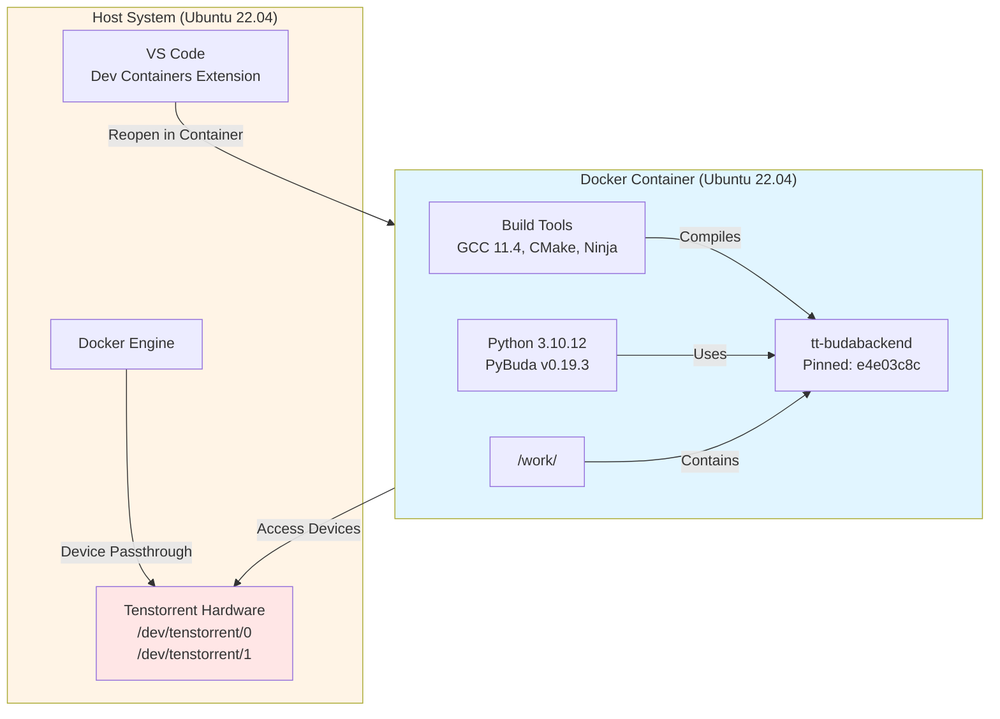
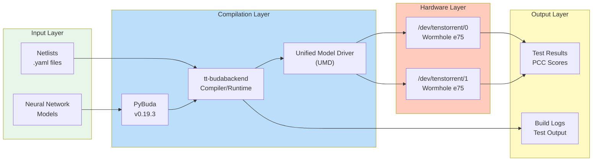
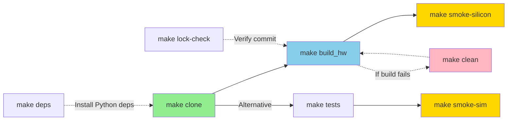
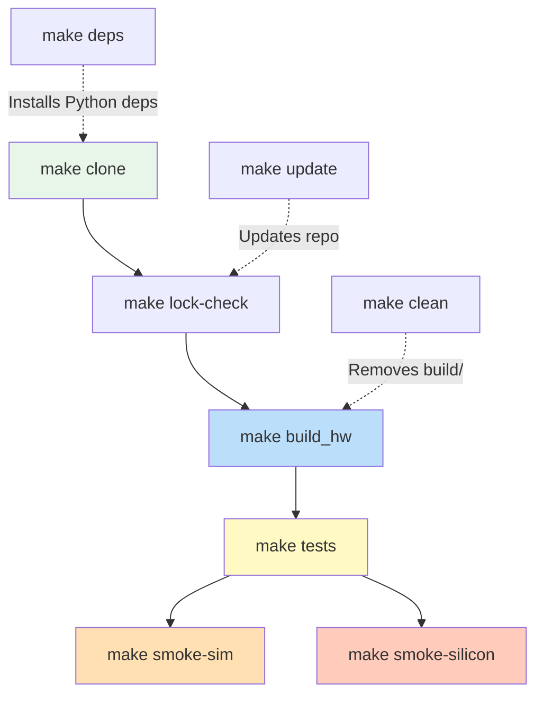
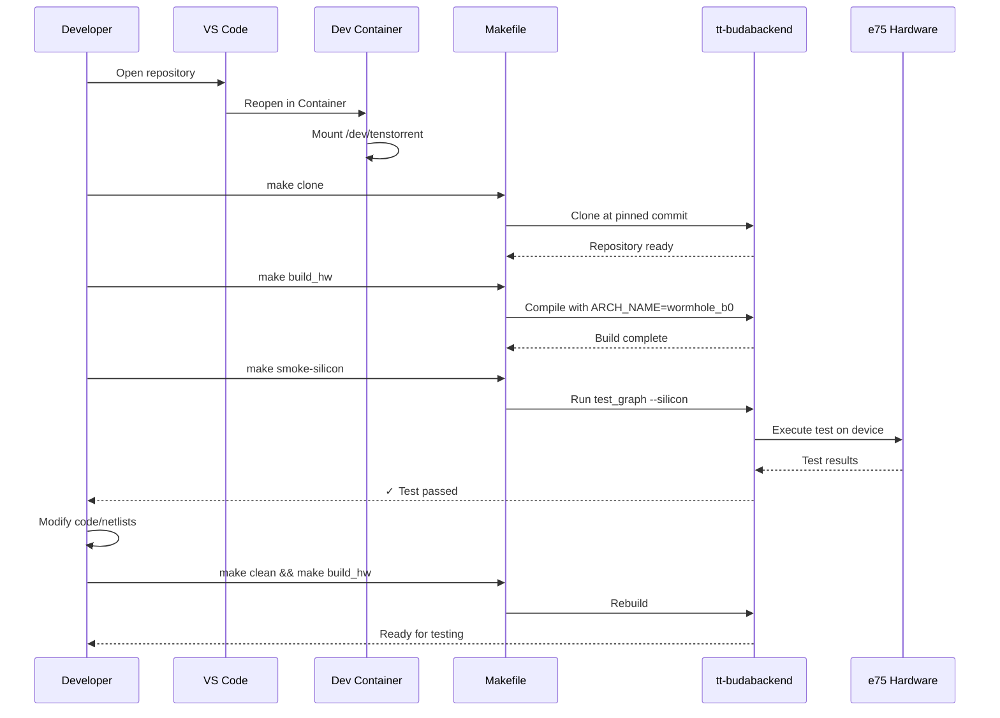
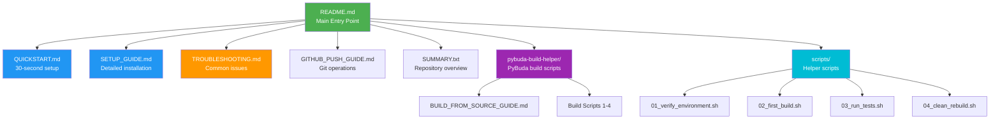
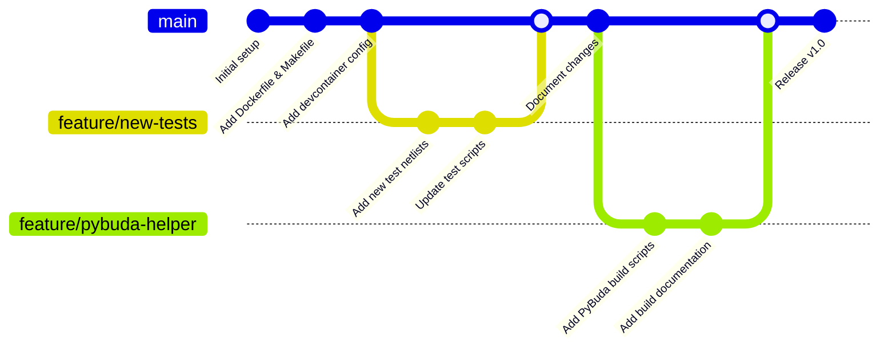
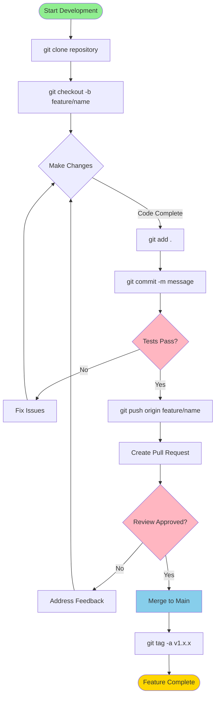

# Tenstorrent Wormhole e75 Development Environment

✅ **Status: VERIFIED WORKING** (2025-10-23)

A Docker-based development environment for Tenstorrent Wormhole e75 accelerators, with VS Code Dev Container integration.

## 📊 Architecture Diagrams

### System Architecture



## ⚡ Quick Start

```bash
# Open in VS Code
code .

# Reopen in Container: Ctrl+Shift+P → "Dev Containers: Reopen in Container"

# Inside container:
make clone && make build_hw && make smoke-silicon
```

See **[QUICKSTART.md](QUICKSTART.md)** for detailed instructions.

## 🎯 What This Is

This repository provides a **complete, reproducible development environment** for:

- **Hardware**: 2x Tenstorrent Wormhole e75 PCIe cards
- **Software**: Legacy PyBuda v0.19.3 stack (frozen/pinned versions)
- **Purpose**: Develop and test neural network models on Greyskull hardware
- **Environment**: Containerized Ubuntu 22.04 with Python 3.10

## ✅ Verified Working

**Test Results** (2025-10-23):
```
[✓] Container builds successfully (5 min)
[✓] tt-budabackend compiles (10 min)
[✓] Silicon test passed (1.2s)
    - Detected: 2 PCI devices
    - Test: softmax single tile
    - Accuracy: PCC 0.9999, allclose 100%
```

**Hardware Tested**:
- 2x Tenstorrent Wormhole e75 (PCIe Vendor ID: 1e52)
- Devices: `/dev/tenstorrent/0` and `/dev/tenstorrent/1`

## 📦 What's Included

```
├── Dockerfile                  # Container with Python 3.10, build tools, ZeroMQ
├── .devcontainer/              # VS Code container config with device passthrough
├── Makefile                    # Build automation (clone, build_hw, tests)
├── Makefile.lock               # Pinned commit: e4e03c8c
├── scripts/
│   ├── 01_verify_environment.sh
│   ├── 02_first_build.sh
│   ├── 03_run_tests.sh
│   └── 04_clean_rebuild.sh
├── setup_greyskull_legacy.sh   # Host setup (requires legacy artifacts)
├── QUICKSTART.md               # 30-second setup guide
├── SETUP_GUIDE.md              # Detailed installation
└── TROUBLESHOOTING.md          # Common issues and solutions
```

## 🔧 Prerequisites

- **OS**: Ubuntu 22.04 LTS
- **Hardware**: Tenstorrent Wormhole e75 PCIe card(s)
- **Docker**: 20.10+ (user in docker group)
- **VS Code**: With Dev Containers extension (v0.427+)
- **Disk Space**: ~5GB for container, ~2GB for build artifacts

## 🌊 Data Flow Architecture



## 🔄 Build Workflow



### Build Target Dependencies



## 🔧 Development Workflow



## 📖 Documentation Structure



## 📖 Documentation

| Document | Purpose |
|----------|---------|
| **[QUICKSTART.md](QUICKSTART.md)** | Get running in 30 seconds |
| **[SETUP_GUIDE.md](SETUP_GUIDE.md)** | Comprehensive setup instructions |
| **[ARCHITECTURE.md](ARCHITECTURE.md)** | 🆕 Detailed system architecture and design |
| **[TROUBLESHOOTING.md](TROUBLESHOOTING.md)** | Solutions to common issues |
| **[GITHUB_PUSH_GUIDE.md](GITHUB_PUSH_GUIDE.md)** | Git operations and push guide |
| **[IMPROVEMENTS.md](IMPROVEMENTS.md)** | 🆕 Suggested repository improvements |
| **[pybuda-build-helper/](pybuda-build-helper/)** | PyBuda build-from-source tools |

## 🎓 Common Commands

```bash
# Build and test
make clone          # Clone tt-budabackend at pinned commit
make build_hw       # Build hardware backend
make smoke-silicon  # Quick hardware test

# Development
make clean          # Clean build artifacts
make update         # Update to pinned commit
make lock-check     # Verify at correct commit

# Helpers
./scripts/01_verify_environment.sh  # Check setup
./scripts/03_run_tests.sh           # Run full test suite
./scripts/04_clean_rebuild.sh       # Clean rebuild
```

## ⚠️ Important Notes

### Legacy Stack (FROZEN)

This environment uses **legacy, end-of-life software**:
- **Python 3.10 REQUIRED** (PyBuda breaks on 3.12+)
- **Wormhole e75** is EOL hardware
- **Do NOT upgrade** to mainline TT-Forge
- All versions frozen for reproducibility

### Pinned Versions

| Component | Version/Commit |
|-----------|----------------|
| tt-budabackend | `e4e03c8c2bf07af4ca5b878808408b89fd27778d` |
| PyBuda | v0.19.3 |
| TT-KMD | v1.31 |
| Firmware | fw_pack-80.14.0.0 |
| TT-Metalium | v0.55 |
| Python | 3.10.12 |

## 🐛 Troubleshooting

Common issues? Check **[TROUBLESHOOTING.md](TROUBLESHOOTING.md)** for:
- Build errors (PyYAML, ZeroMQ, git-lfs)
- Container issues (permissions, device access)
- Test failures (VERSIM, hugepages)

## 📊 Build Statistics

- **Container Build**: ~5 minutes (first time)
- **tt-budabackend Clone**: ~2 minutes (with submodules)
- **Hardware Build**: ~10 minutes (16 parallel jobs)
- **Smoke Test**: ~1-5 seconds
- **Total Setup Time**: ~20 minutes from scratch

## 🏗️ Architecture

```
Host (Ubuntu 22.04)
├── /dev/tenstorrent/0,1    ← Greyskull cards
│
└── Docker Container (Ubuntu 22.04)
    ├── Python 3.10.12
    ├── Build Tools (gcc 11.4, cmake 3.22, ninja 1.10)
    ├── Dependencies (ZeroMQ, Boost, PyYAML)
    └── /work/
        ├── tt-budabackend/        ← Compiler/runtime
        │   ├── build/lib/         ← Compiled libraries
        │   └── umd/               ← Unified Model Driver
        └── scripts/               ← Helper scripts
```

## 📝 Development Workflow

1. **Modify netlists**: Edit files in `tt-budabackend/verif/graph_tests/netlists/`
2. **Rebuild**: `make clean && make build_hw`
3. **Test**: `make smoke-silicon`
4. **Iterate**: Repeat as needed

## 🚀 Next Steps

After successful setup:
1. Explore example netlists in `tt-budabackend/verif/graph_tests/netlists/`
2. Run comprehensive tests: `./scripts/03_run_tests.sh`
3. Read tt-budabackend documentation
4. Customize Makefile targets for your workflow

## 🔀 Git Workflow



### Git Operations Guide



## �� License

This repository configuration is provided as-is. Individual components (tt-budabackend, etc.) have their own licenses.

## 🔗 References

- [tt-budabackend](https://github.com/tenstorrent/tt-budabackend) - Deprecated backend compiler
- [tt-forge](https://github.com/tenstorrent/tt-forge) - Modern replacement (not compatible with Wormhole e75)
- [Tenstorrent](https://tenstorrent.com/) - Company website

---

**Created**: 2025-10-23 03:18:11  
**Last Verified**: 2025-10-23 09:37:00  
**Git Commits**: 5 (initial setup → working state)  
**Test Status**: ✅ PASSING (PCC 0.9999)
